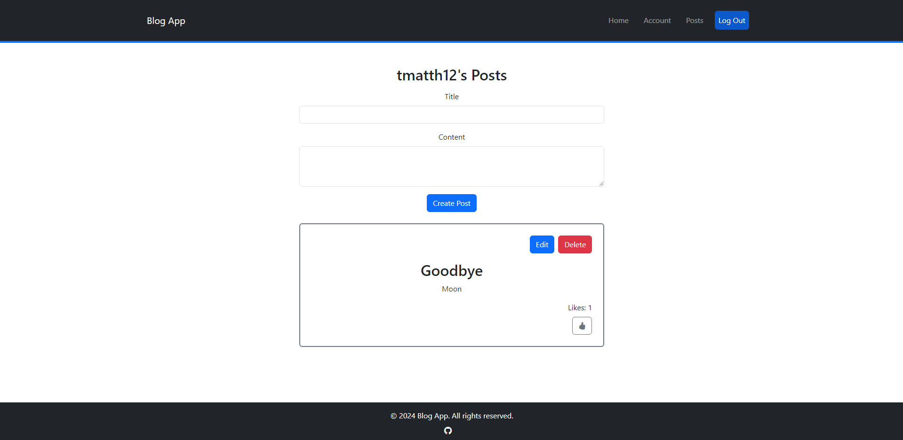

# Blog App

The Blog App is a full-stack application that allows users to create, read, update, and delete blog posts from their own accounts managed by JWT authentication. They are also able to view and like or unlike posts from other users. This app is meant to be a personal project to practice building full-stack applications with the PERN stack. You are free to make changes to this app or use it as a reference for your own projects.

The app is built with the following technologies:
- **Frontend**: React + Vite, Bootstrap 5
- **Backend**: Express.js, Node.js PostgreSQL

To start the app, follow the instructions below:

1. Clone the repository.

2. Run `npm install` in both the client and server directories to install the dependencies.

3. Run `docker compose up` in the server directory to start the PostgreSQL database with Docker.

4. Run `npm run start` in the server directory to start the Express.js server.

5. Run `npm run dev` in the client directory to start the Vite development server.