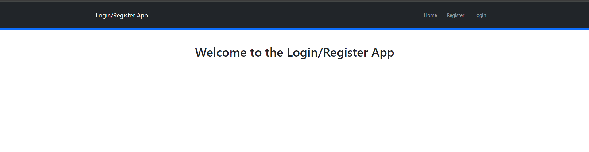

# Login/Register App

The Login/Register App is a full-stack application that allows users to register and log in. It consists of a client-side built with React and Vite, and a server-side built with Express.js. The app includes features such as user authentication, protected routes, and token-based authorization. It is meant to be a starting point for building more complex applications that require user registration and login functionality.

To start the app, follow the instructions below:

1. Clone the repository.

2. Run `npm install` in both the client and server directories to install the dependencies.

3. Run `docker compose up` in the server directory to start the PostgreSQL database with Docker.

4. Run `npm run start` in the server directory to start the Express.js server.

5. Run `npm run dev` in the client directory to start the Vite development server.